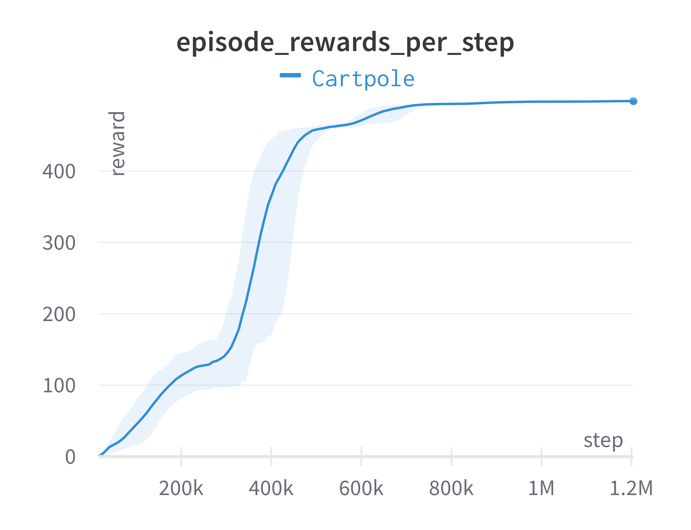
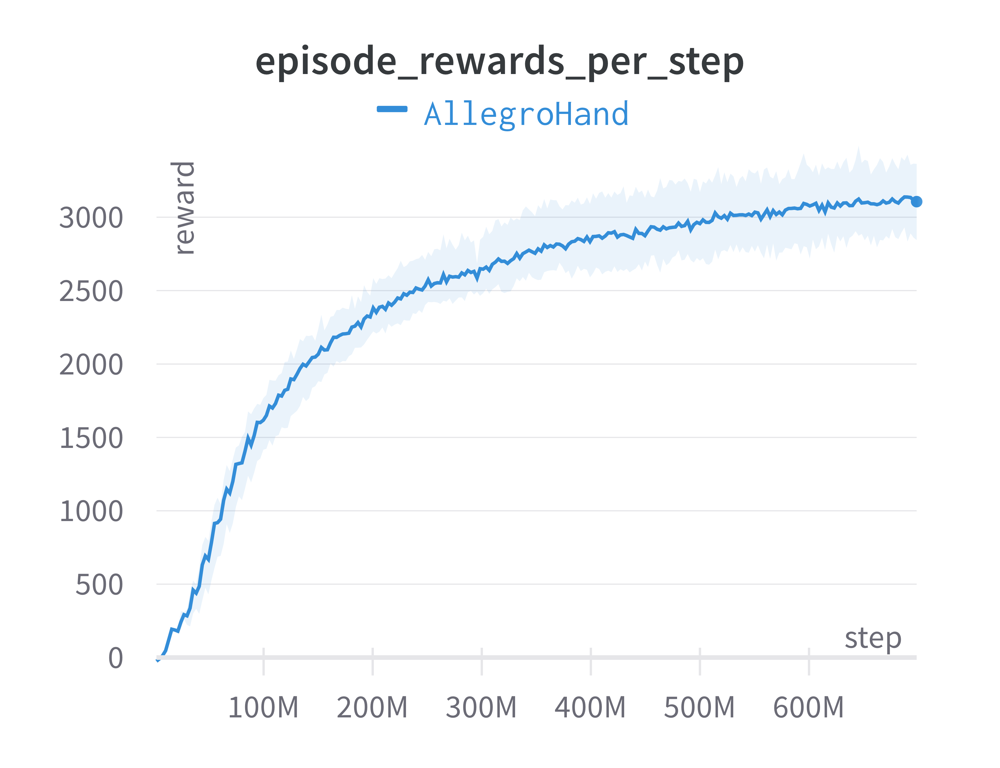

# minimal-stable-PPO

A minimal and stable Proximal Policy Optimization ([PPO](https://arxiv.org/pdf/1707.06347.pdf)), tested on IsaacGymEnvs.

## Requirements

* Python (tested on 3.7)
* PyTorch (tested on 1.8.1)

## Training on IsaacGymEnvs

Following instructions [here](https://github.com/NVIDIA-Omniverse/IsaacGymEnvs) to install Isaac Gym and the IsaacGymEnvs repo.

Optional instructions for cleaner code and dependencies:
* Under [isaacgymenvs](https://github.com/NVIDIA-Omniverse/IsaacGymEnvs/tree/main/isaacgymenvs) directory, the `cfg`, `learning` subdirectories and `train.py` file can be removed.
* The dependency on `rl-games` on [this](https://github.com/NVIDIA-Omniverse/IsaacGymEnvs/blob/main/setup.py#L22) line can be removed.

### First example
To train a policy on Cartpole, run
```bash
python train.py task=Cartpole
```
Cartpole should converge to optimal within a few seconds of starting.

In `configs` directory, we provide the main config file and template configs for `Cartpole` and `AllegroHand` tasks. We use [Hydra](https://hydra.cc/docs/intro/) for config management following IsaacGymEnvs.

### Custom tasks
To train on additional tasks, follow the template configs to define `[new_task].yaml` under `configs/task` and `[new_task]PPO.yaml` under `configs/train`.

### Results

Logging on TensorBoard and WandB are supported by default.

Our PPO results match IsaacGymEnvs' default RL implementation, in terms of both training speed and performance.

#### Cartpole in 40 seconds


#### AllegroHand in 3 hours


## Key arguments and parameters

### Main config (`config.yaml`)

* `task=TASK` - Selects which task to use. Options correspond to the config for each environment in `configs/task`.
* `num_envs=NUM_ENVS` - Selects the number of environments to use (overriding the default number of environments set in the task config).
* `seed=SEED` - Sets a seed value for randomizations, and overrides the default seed set up in the task config.
* `device_id=DEVICE_ID` - Device used for physics simulation and the RL algorithm.
* `graphics_device_id=GRAPHICS_DEVICE_ID` - Which Vulkan graphics device ID to use for rendering. Defaults to 0. **Note** - this may be different from CUDA device ID, and does **not** follow PyTorch-like device syntax.
* `pipeline=PIPELINE` - Which API pipeline to use. Defaults to `gpu`, can also set to `cpu`. When using the `gpu` pipeline, all data stays on the GPU and everything runs as fast as possible. When using the `cpu` pipeline, simulation can run on either CPU or GPU, depending on the `sim_device` setting, but a copy of the data is always made on the CPU at every step.
* `test=TEST`- If set to `True`, only runs inference on the policy and does not do any training.
* `checkpoint=CHECKPOINT_PATH` - Set to path to the checkpoint to load for training or testing.
* `headless=HEADLESS` - Whether to run in headless mode.
* `output_name=OUTPUT_NAME` - Sets the output folder name.
* `wandb_mode=WANDB_MODE` - Options for using WandB.

### RL config (`train/[task_name]PPO.yaml`)

The main configs to experiment with are:

* `train.network.mlp.units`
* `train.ppo.gamma`
* `train.ppo.tau`
* `train.ppo.learning_rate`
* `train.ppo.lr_schedule`
* `train.ppo.kl_threshold` (only relevant when `lr_schedule == 'kl'`)
* `train.ppo.e_clip`
* `train.ppo.horizon_length`
* `train.ppo.minibatch_size`
* `train.ppo.max_agent_steps`

We recommend the default value for other configs, but of course, RL is RL :)

Here are some helpful guides to tuning PPO hyperparameters:

[The 37 Implementation Details of Proximal Policy Optimization](https://iclr-blog-track.github.io/2022/03/25/ppo-implementation-details/)

[Engstrom L, Ilyas A, Santurkar S, Tsipras D, Janoos F, Rudolph L, Madry A. Implementation matters in deep policy gradients: A case study on ppo and trpo. International Conference on Learning Representations, 2020](https://arxiv.org/abs/2005.12729)

[Andrychowicz M, Raichuk A, Stańczyk P, Orsini M, Girgin S, Marinier R, Hussenot L, Geist M, Pietquin O, Michalski M, Gelly S. What matters in on-policy reinforcement learning? a large-scale empirical study. International Conference on Learning Representations, 2021](https://arxiv.org/abs/2006.05990)

[Duan Y, Chen X, Houthooft R, Schulman J, Abbeel P. Benchmarking deep reinforcement learning for continuous control. In International conference on machine learning 2016 Jun 11 (pp. 1329-1338). PMLR.](https://arxiv.org/abs/1604.06778)

I also documented a few general takeaways in [this](https://twitter.com/ToruO_O/status/1643469546765029376?cxt=HHwWgMDQ4Yy2484tAAAA) tweet.

## Wait, doesn't IsaacGymEnvs already provide RL training scripts?

Yes, [rl_games](https://github.com/Denys88/rl_games/tree/master/rl_games) has great performance but could be hard to use.

If all you're looking for is a **simple, clean, performant** PPO that is easy to modify and extend, try this repo :))) And feel free to give feedback to make this better!


## Citation

Please use the following bibtex if you find this repo helpful and would like to cite:

    @misc{minimal-stable-PPO,
      author = {Lin, Toru},
      title = {A minimal and stable PPO},
      year = {2023},
      publisher = {GitHub},
      journal = {GitHub repository},
      howpublished = {\url{https://github.com/ToruOwO/minimal-stable-PPO}},
    }
